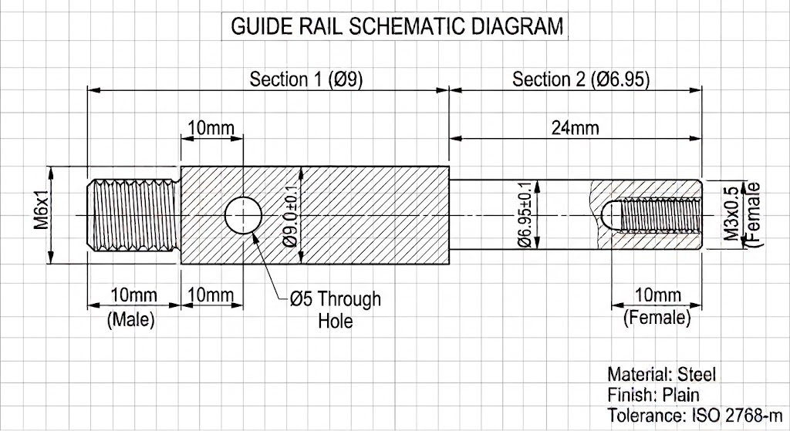
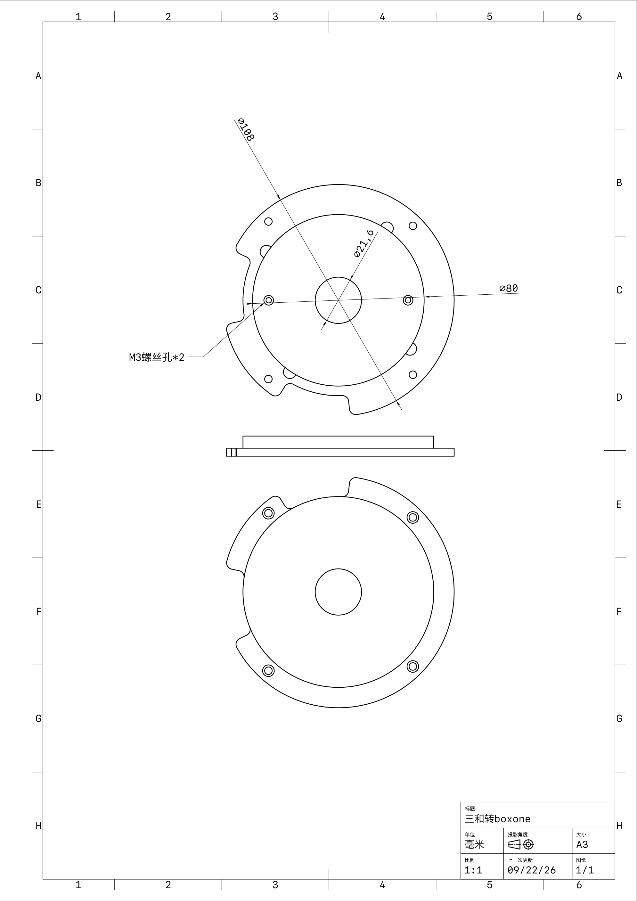
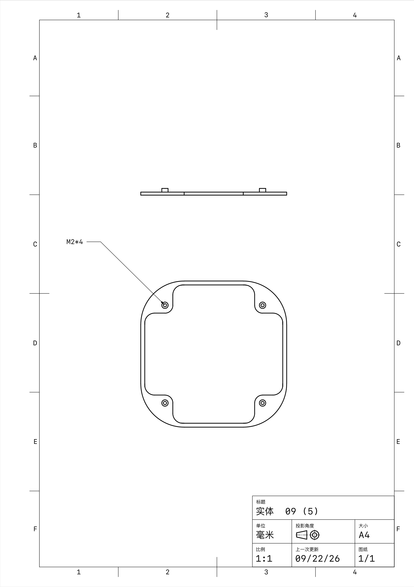
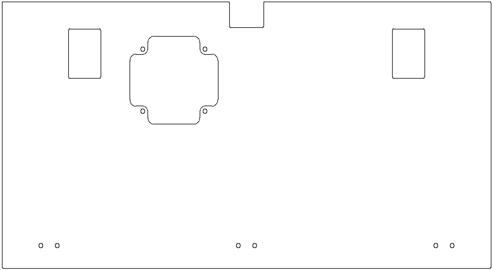
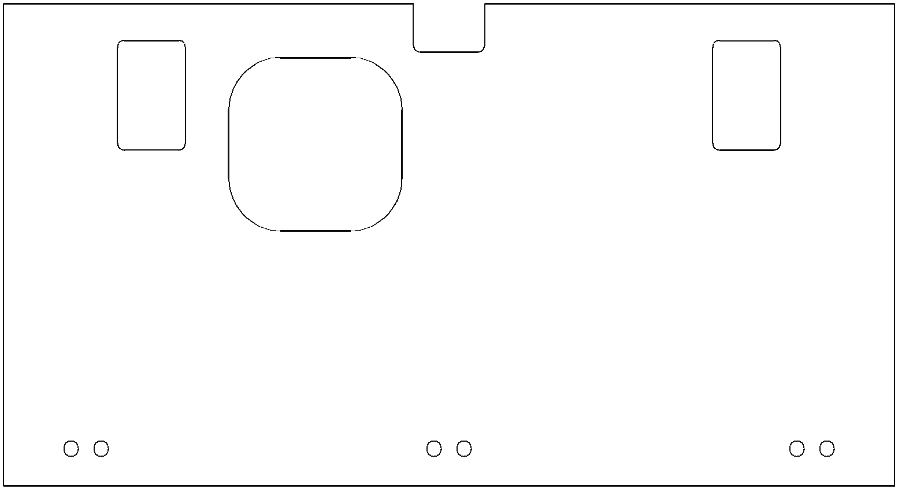
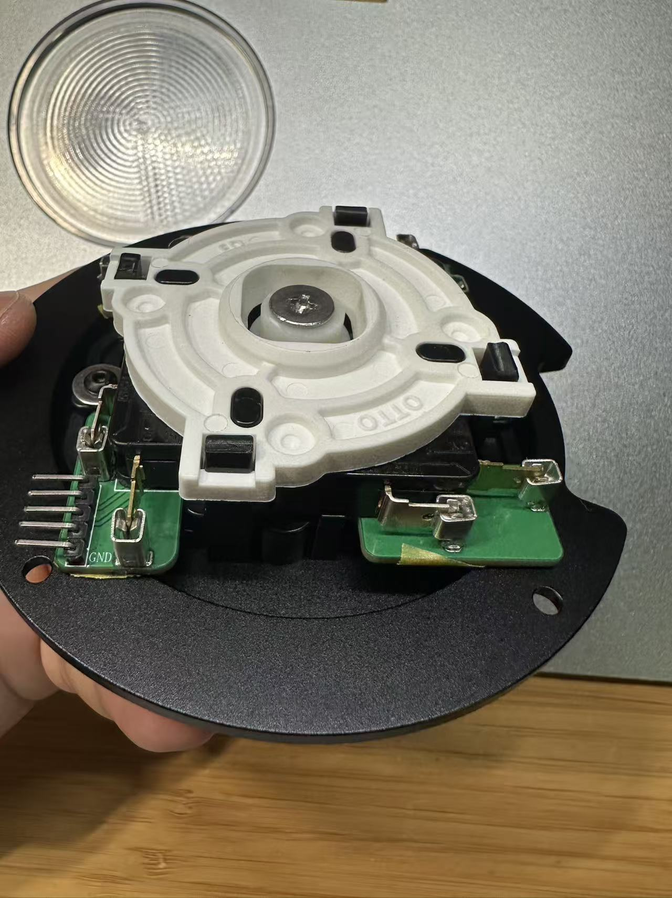
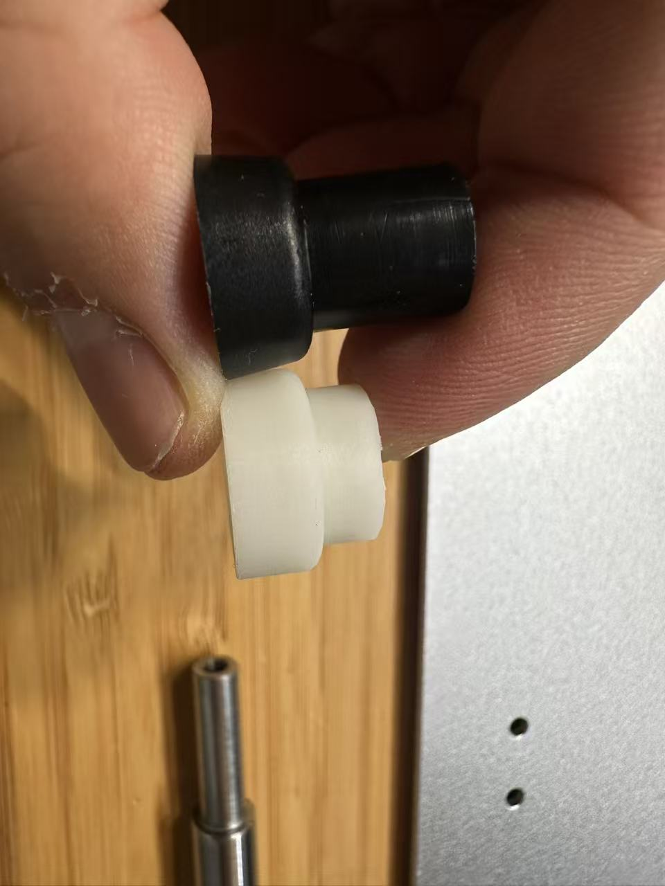
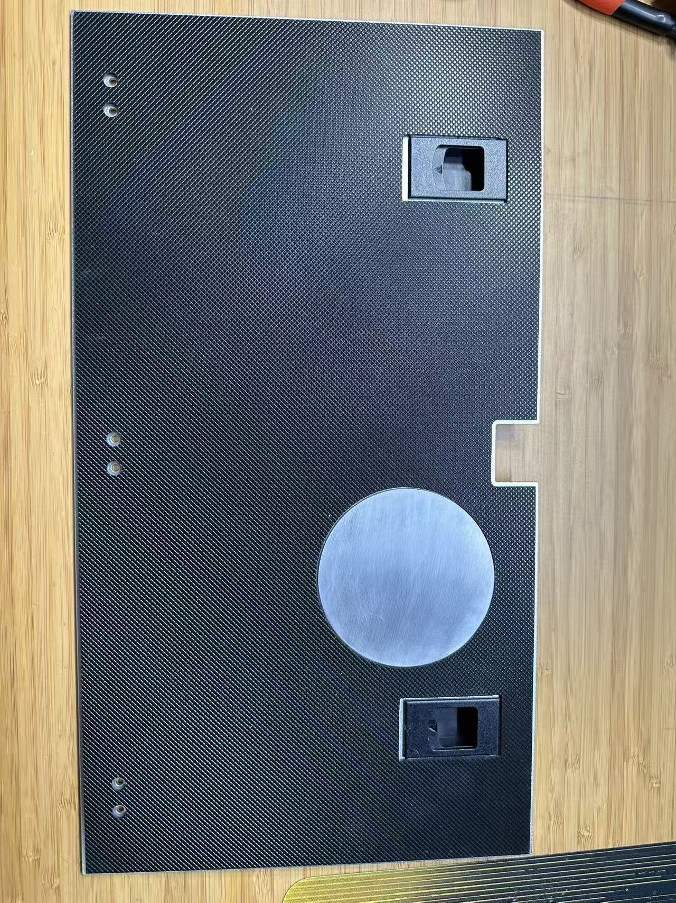

# Retro plus Box one × 三和摇杆 改装套件 · 使用说明

> 把手感扎实的三和（Sanwa）街机摇杆塞进 Retro+ Box 框体。
> 不改框体、不打孔破坏原结构 —— 只做三件事：**换短杆芯 / 上CNC件 / 换底板**。
>
> *A DIY mod kit that fits a Sanwa arcade joystick into the Retro+ Box one chassis — shortened shaft, CNC adapter bracket, and a replacement base plate.*

[](https://creativecommons.org/licenses/by/4.0/)

> **许可**：CC BY 4.0 —— 自用 / 改良 / 分享 / **贩卖**都行，**署名即可**。详见 [第 11 节](#11-许可与致谢)。

---

## 目录

- [Retro plus Box one × 三和摇杆 改装套件 · 使用说明](#retro-plus-box-one--三和摇杆-改装套件--使用说明)
  - [目录](#目录)
  - [1. 项目简介](#1-项目简介)
  - [2. 适配范围与动手门槛](#2-适配范围与动手门槛)
  - [3. 文件清单](#3-文件清单)
  - [4. 零件清单（BOM）](#4-零件清单bom)
  - [5. 五金件与耗材](#5-五金件与耗材)
  - [10. 安全与注意事项](#10-安全与注意事项)
  - [11. 许可与致谢](#11-许可与致谢)

---

## 1. 项目简介

Retro+ Box one里面安装三和摇杆有以下三个问题。

| 问题 | 解决方案 |
| --- | --- |
| **杆芯 / 触发器太长** | 换一根**加短杆芯**（图纸零件1，车削件），关键是下端要24mm（比原装减少6mm），上端长度可以按照用户喜好自己修改，同时把摇杆的**塑料触发器切短 6 mm**（见 [实拍图](docs/images/7-触发器切短6mm.jpg)） |
| **安装孔位不合适** | 做一个一个**CNC 转接支架**（零件2），负责转接|
| **底板** | **改装底板**（零件4），在底板底下加个cnc块用来偷点高度Z（零件3），并在外侧加一层**硅胶防滑垫**（零件 5）, 暴力玩家直接在原底板上开孔也可以 |

整套改装共 **5 个零件 + 1 组五金**，全部图纸随本仓库开源，你可以直接拿去加工。

---

## 2. 适配范围与动手门槛

| 项目 | 说明 |
| --- | --- |
| **适配框体** | Retro+ Box one（请以实物孔位为准；本套件基于 *［框体具体型号/批次，请补充］* 测绘） |
| **适配摇杆** | 三和 Sanwa JLF 系列（JL**F**-TP-8YT / JLF-TP-8Y 等）；*［其他型号请先核对螺纹与安装板孔距］* |
| **加工要求** | 车削（零件①）、CNC 铣削（零件②③）、激光切割（零件④⑤） |
| **动手门槛** | ⭐⭐⭐☆☆ 需要会拆装摇杆、会用内六角螺丝刀 |

---

## 3. 文件清单

所有图纸位于 `sanwa_mod/` 目录：

| 文件 | 类型 | 用途 | 加工方式 | 备注 |
| --- | --- | --- | --- | --- |
| `杆芯.png` | 二维图纸 | 短杆芯的尺寸标注图 | 车削 | 附带的二维图纸，无 3D 模型，需师傅按图加工 |
| `支架.step` | 3D 模型 | 转接支架，可直接编程加工 | CNC | 首选给加工的格式 |
| `支架.pdf` | 二维图纸 | 支架工程图（含公差、孔位标注） | 参考 | A3 图框，供检验/沟通 |
| `封盖.step` | 3D 模型 | 摇杆口封盖 | CNC / 3D 打印 | 首选给加工的格式 |
| `封盖.pdf` | 二维图纸 | 封盖工程图 | 参考 | A4 图框 |
| `底板 2mm材料自选.dxf` | 二维矢量 | 底板切割轮廓 + 全部开孔 | 激光 / 水刀 / 雕刻机 | 单位 **mm**，图层名 `底板`，1:1 |
| `防滑垫 2mm硅胶.dxf` | 二维矢量 | 防滑垫切割轮廓 | 激光 / 刀模 | 单位 **mm**，图层名 `防滑垫`，1:1 |
| `摇杆模块组合示意图.jpg` | 实拍照片 | 摇杆模块（支架 + 摇杆本体 + 微动/PCB）的组合状态 | 参考 | 装配时对照 |
| `触发器切短6MM.jpg` | 实拍照片 | 需要切短 6 mm 的塑料触发器，及成品杆芯 | 参考 | **改杆必看** |
| `底板示意图.jpg` | 实拍照片 | 底板 + 防滑垫 + 封盖的成品状态 | 参考 | 装配结果对照 |

**预览**

| ① 杆芯 | ② 支架 | ③ 封盖 |
| --- | --- | --- |
|  |  |  |

| ④ 底板 | ⑤ 防滑垫 |
| --- | --- |
|  |  |

> `docs/images/` 中的底板、防滑垫预览图由 DXF 直接渲染生成，仅供快速核对，**加工请务必使用原始 DXF 文件**。

**实拍参考**

| 摇杆模块组合 | 触发器切短 6 mm | 底板成品 |
| --- | --- | --- |
|  |  |  |
| 支架 + 摇杆本体 + 微动/PCB 组合后的样子，摇杆卡扣需要剪短，档圈需要用OTTO的 | 塑料触发器需切短 6 mm；下方为车好的短杆芯 | 碳纤维底板 + 硅胶防滑垫 + 铝封盖 |

---

## 4. 零件清单（BOM）

| # | 名称 | 数量 | 建议材料 | 工艺 | 关键尺寸（mm） |
| :-: | --- | :-: | --- | --- | --- |
| ① | **短杆芯** | 1 | 不锈钢 304 或 7075 铝 | 车削 + 攻丝 | 全长约 **61**；分三段：**M6×1 外螺纹 × 10** ／ **Ø9 × 27** ／ **Ø6.95 × 24**（端部 **M3×0.5 内螺纹，深 10**） |
| ② | **转接支架** | 1 | 6061-T6 铝合金 | CNC 铣削 | 主体 **Ø89**，两侧耳部包络 **Ø108**，台阶 **Ø80**，中心过孔 **Ø21.6**，总高 **9.4**；**4× Ø3.5 通孔（配 Ø5.4 沉孔）**、**2× M3 螺纹孔（Ø2.5 底孔 + Ø4.5 沉孔）** |
| ③ | **封盖** | 1 | 6061 铝合金（或 PLA+ 验证） | CNC / 3D 打印 | **74 × 74 × 3.4**，四角 **R22**；**4× M2 螺纹孔**，孔距 **49.5 × 49.5** |
| ④ | **底板** | 1 | 2 mm 厚板材（铝 / 碳纤维 / 亚克力 / PC） | 激光切割 | **389 × 212.5**，厚 **2**；摇杆口 **70 × 70**（四角 R4 凹圆弧避让，旁配 **4× Ø3.3** 封盖孔，孔距 **49.5 × 49.5**）、走线缺口 **25 × 20.5**、两侧长圆孔 **25.5 × 39.5**、**6× Ø3.3** 固定孔 |
| ⑤ | **防滑垫** | 1 | 2 mm 硅胶板 / 橡胶板 | 激光切割 | **385.5 × 209**，厚 **2**；开孔比底板各放大 2–4 mm（中央 **75 × 75**、两侧 **29.5 × 47.5**、**6× Ø6.5** 沉台孔） |

> 🔧 **不要漏掉这一步**：除了上面 5 个零件，还必须把**原厂摇杆的塑料触发器切短 6 mm** —— 这是改装动作、不是新增零件，但没有它模块总高压不下去（详见 [6.1](#61-零件-短杆芯车削) 与装配步骤 2）。

**材料选择建议**

- **零件 ①**：优先 **不锈钢 304**（耐磨、抗螺纹滑牙）；想减重可用 7075 铝，但螺纹处易磨损，建议旋入端涂一点螺纹胶。
- **零件 ②**：**6061-T6** 最稳妥。它是受力件，不建议 3D 打印。
- **零件 ③**：CNC铝。
- **零件 ④**：碳纤维/铝/不锈钢/PC等等都行。
- **零件 ⑤**：**2 mm 硅胶** 手感最好；买不到用 2 mm 橡胶板也行。

---

## 5. 五金件与耗材

| 名称 | 规格 | 数量 | 用途 | 建议 |
| --- | --- | :-: | --- | --- |
| 内六角/十字螺钉 | **M2 × 4** | 4 | 固定封盖 | 封盖只有 3.4 mm 厚，有可能需要垫片，**别用超过 5 mm 的** |
| 内六角螺钉 | **M3 × 5** | 6 | 固定转接支架和摇杆模块|
| 扁头螺钉 | **M3** | 1 | 头一定要大，要大于7MM, 要扁，厚度1mm出头即可，选M4或者M5也可以，杆芯图纸要相对应更改| 

**原厂摇杆五金**（拆解时保留，别丢）：球头、防尘片、弹簧、限位片（八角片/圆片）、微动开关板、E 型挡圈/卡簧。


---

## 10. 安全与注意事项

- **加工安全**：车削/CNC 会产生铝屑与毛刺，务必**戴护目镜、去毛刺后再装配**；激光切割硅胶有气味，注意通风。
- **螺纹保护**：M2、M3 是细牙小螺纹，**拧到感觉变紧就停**，过力必滑牙。滑了可以在孔内滴少量螺纹胶 + 换长一点的螺丝补救。
- **本仓库图纸基于作者自己的框体实测**，不同批次框体可能有差异。**加工前请先用卡尺核对你的实物**，尤其是底板外轮廓与 6 个固定孔。
**免责声明**：本项目为个人 DIY 改装方案，造成的框体损坏、摇杆损坏或其他损失由使用者自行承担。图纸仅供参考，请自行核对尺寸后再加工。

---

## 11. 许可与致谢

本项目（图纸 + 文档）采用 **Creative Commons Attribution 4.0 International（CC BY 4.0，署名 4.0 国际）** 许可协议。完整法律文本见仓库根目录的 [`LICENSE`](LICENSE)。

**你可以自由地：**

| | 权利 | 说明 |
| --- | --- | --- |
| ✅ | **自用** | 照图纸给自己做一套，随便做 |
| ✅ | **改良** | 改尺寸、换材料、增减零件，做衍生版本 |
| ✅ | **分享** | 转载、转发、随成品附送图纸 |
| ✅ | **贩卖** | **允许商业使用** —— 出成品出售、批量生产、开店接单都可以 |

**唯一的条件：署名。**

使用、改编或销售时，必须**注明原作者（del874）**、附上本协议链接，并**说明你是否做过修改**。建议在商品页 / 说明书 / 你的仓库里保留这样一行：

```text
本设计基于 del874 的「摇杆改装套件」，
采用 CC BY 4.0 协议（https://creativecommons.org/licenses/by/4.0/），
已做修改：<改了哪些地方，没改就写"未修改">
```

换句话说：**没有非商业限制，也不要求相同方式共享**（你的衍生版本可以用任何协议发布）。你做出的实物成品、售出所得都归你，无需向作者分成或另行授权。

几点补充：

- CC BY 4.0 授权的是**著作权**，不涉及专利与商标。你要是给改良版申请了专利，那是你自己的权利。
- 署名只代表**来源出处**，不代表原作者为你的成品质量或安全背书。成品的安全与合规责任仍在使用者。
- **RETRO+** **BOX ONE** **三和（Sanwa）** 为各自权利人的商标，本项目与其无关联，仅为兼容性改装。
- 欢迎在 Issues 里反馈尺寸/装配问题，也欢迎 PR 补充你自己的框体实测数据。

---
